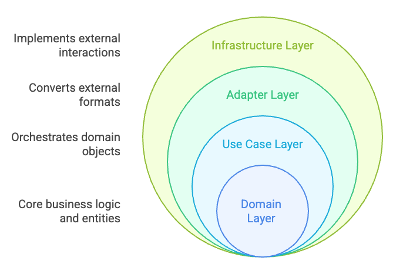

# Project Name

A Python project template following clean architecture principles.

## Overview

This project follows a structured approach to software development with:

- Clean Architecture principles
- Domain-Driven Design
- Modular component design
- Comprehensive testing

## Features

- **Modern Python**: Requires Python 3.11+
- **Clean Architecture**: Structured layers with clear boundaries
- **Test-Driven**: Comprehensive test suite with pytest
- **Quality Tools**: Ruff for linting and formatting
- **CI/CD Ready**: GitHub Actions workflows included

## Project Structure

```
src/
├── domain/       # Core business logic and entities
├── use_cases/    # Application business logic
├── adapters/     # Interface adapters
└── infrastructure/ # Implementation details
```

## Clean Architecture

This project follows Clean Architecture principles, organising code into four concentric layers with dependencies pointing inward.

<p align="center">
  
</p>

### Layer Structure

1. **[Domain Layer](./src/project_name/domain/README.md)** (Innermost)
   - Contains business entities and core logic
   - Independent of frameworks, databases, and external services
   - Location: `src/project_name/domain/`

2. **[Use Case Layer](./src/project_name/use_cases/README.md)**
   - Orchestrates domain objects to fulfill application flows
   - Defines boundaries between external world and domain
   - Location: `src/project_name/use_cases/`

3. **[Adapter Layer](./src/project_name/adapters/README.md)**
   - Converts between external formats and internal models
   - Transforms API requests into use case inputs and vice versa
   - Location: `src/project_name/adapters/`

4. **[Infrastructure Layer](./src/project_name/infrastructure/README.md)** (Outermost)
   - Implements technical details for external interactions
   - Contains database connections, API clients, and frameworks
   - Location: `src/project_name/infrastructure/`

### Key Principles

- Dependencies always point inward
- Inner layers define interfaces that outer layers implement
- Business rules remain isolated from delivery mechanisms
- The system becomes testable and adaptable to change

### Application Flow Example

For a REST API that processes requests and interacts with external systems:

1. **Request Received**:
   - Infrastructure layer (FastAPI) receives HTTP request
   - Request is passed to adapter layer

2. **Request Processing**:
   - Adapter layer converts HTTP request to use case input
   - Use case orchestrates domain entities and business logic
   - Domain layer enforces core business rules

3. **External Interactions**:
   - Domain layer defines repository interfaces
   - Adapter layer implements these interfaces
   - Infrastructure layer handles database and API connections

4. **Response Delivery**:
   - Results flow back through layers
   - Use case assembles response data
   - Adapter layer formats response for HTTP
   - Infrastructure layer delivers HTTP response

You can find more details about this architecture in the [Architecture Document](docs/ARCHITECTURE.md).

## Getting Started

### Project Renaming

This template uses "project_name" as a placeholder. Before you start development, you should rename it to match your actual project name:

1. **Clone the repository**

```bash
git clone https://github.com/yourusername/python-skeleton.git my-project
cd my-project
```

2. **Make the rename script executable**

```bash
chmod +x scripts/rename_project.sh
```

3. **Run the rename script with your desired project name**

```bash
./scripts/rename_project.sh your_project_name
```

> **Note:** The project name should be a valid Python package name: start with a letter and contain only letters, numbers, and underscores.

4. **Review and commit the changes**

```bash
git status
git commit -m "Rename project from project_name to your_project_name"
```

5. **Update remote repository (if needed)**

```bash
git remote set-url origin https://github.com/yourusername/your-project.git
git push -u origin main
```

The rename script automatically:

- Renames the main package directory
- Updates imports and references across all files
- Preserves Git history for most files
- Adds appropriate docstrings to `__init__.py` files

After renaming, you're ready to start development with your custom project name!

## Development

### Prerequisites

- Python 3.11+
- [uv](https://github.com/astral-sh/uv) (recommended package manager)

### Setup

```bash
# Install dependencies
make install-dev
```

### Common Tasks

Use the Makefile for common development tasks:

```bash
# Show all available commands
make help

# Run tests
make test

# Run linting and formatting
make lint
make format

# Run all checks
make check
```

## License

[MIT](LICENSE)
